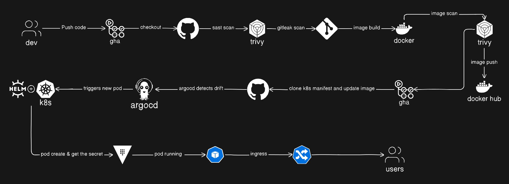

# eCommerce GitOps Manifests

This repository contains the GitOps manifests for deploying a microservices-based eCommerce application on Kubernetes. It utilizes **ArgoCD** for continuous delivery and **HashiCorp Vault** for secret management.

## 📂 Project Structure

- **`argocd/`**: Contains ArgoCD Application definitions and project configurations.
  - **`apps/`**: Application manifests for different environments (`dev`, `shared`).
  - **`bootstrap/`**: Bootstrap configurations to set up the initial environment.
  - **`projects/`**: ArgoCD Project definitions to organize applications.
- **`helm/`**: Contains Helm charts for the application components and infrastructure.
  - **`charts/`**: 
    - **`infrastructure/`**: Charts for backing services like PostgreSQL and RabbitMQ.
    - **`microservice-base/`**: A base Helm chart used by all microservices to ensure consistency.
  - **`environments/`**: Environment-specific values files.

## 🔐 Vault Integration & Secrets Management

This project uses **HashiCorp Vault** responsibly to manage secrets, integrated via the **External Secrets Operator**.

### Setup
- **Vault Helm Chart**: Deployed via `argocd/apps/shared/vault.yaml`.
- **Storage**: Configured with local file storage at `/vault/data`.
- **Access**: Exposed internally at `http://vault.vault.svc.cluster.local:8200` and externally via Ingress at `vault.local`.

### Secret Injection
- **ClusterSecretStore**: A `ClusterSecretStore` named `vault-backend` is configured in `argocd/apps/shared/configs/cluster-secret-store.yaml`.
- **Usage**: Applications reference this store to retrieve secrets injected as Kubernetes Secrets or environment variables.

> **Note**: Ensure the `vault-token` secret is created in the `external-secrets` namespace to allow the External Secrets Operator to authenticate with Vault.

## 🚀 Services & Infrastructure

The GitOps repository manages the deployment of:

### Infrastructure
- **PostgreSQL**: Relational database for services.
- **RabbitMQ**: Message broker for asynchronous communication.

### Microservices
- **API Gateway**: Entry point for the application.
- **Auth Service**: User authentication and authorization.
- **Order Service**: Order processing and management.
- **Product Service**: Product catalog management.

## 🛠️ Usage

### Prerequisites
- Kubernetes Cluster (e.g., Minikube, EKS, GKE)
- `kubectl` installed and configured
- `helm` installed

### Getting Started

1. **Install ArgoCD**:
   Run the provided script to install ArgoCD usually:
   ```bash
   ./argocd-install.sh
   ```

2. **Bootstrap the Cluster**:
   Apply the bootstrap application to kickstart the deployment:
   ```bash
   kubectl apply -f argocd/bootstrap/app.yaml
   ```

3. **Access ArgoCD UI**:
   - Port-forward the ArgoCD server: `kubectl port-forward svc/argocd-server -n argocd 8080:443`
   - Login with the initial admin password.

## 🤝 Contributing

1. Fork the repository.
2. Create a feature branch.
3. Commit your changes.
4. Open a Pull Request.
